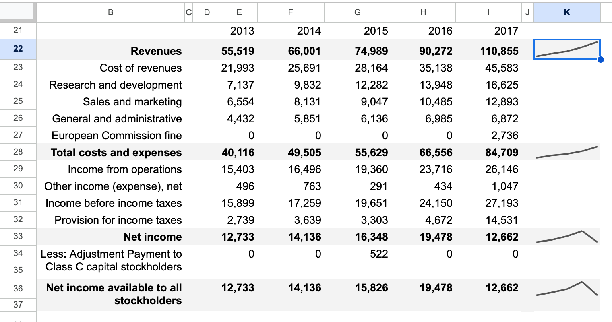
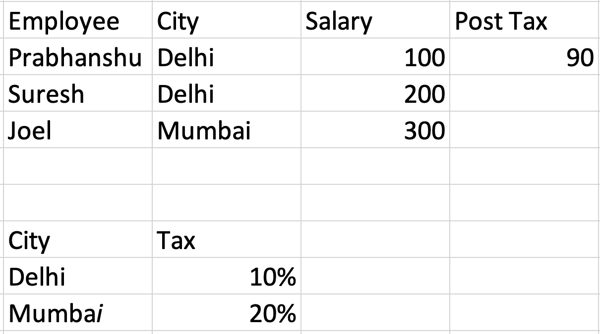
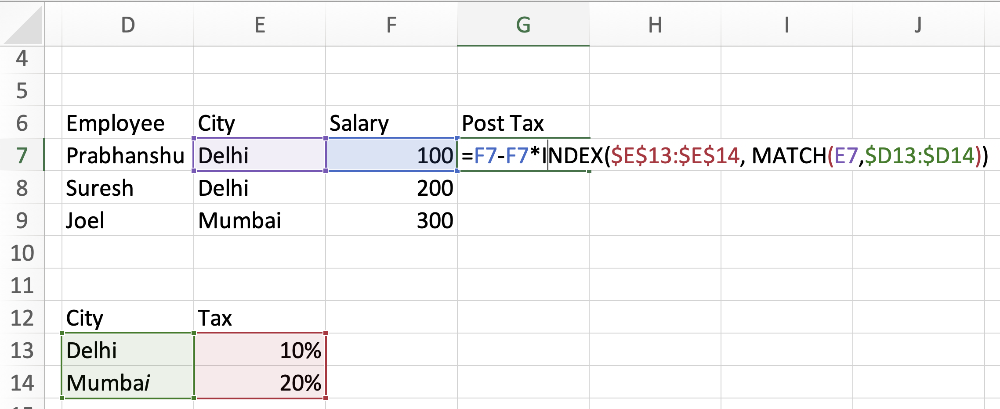
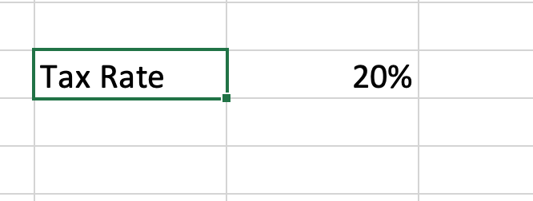

# Collections & Tables in Spreadsheets

- ## Cases in point
	- ### Case 1
		- 
		- The formula for the sparkline graph is `=SPARKLINE(E22:I22)`.
		- When a user wants to add data for 2018, they would need to
			- Add a column after 2017.
			- Remember to update the sparkline formula to `E23:J23`.
			- If they don't remember to update the dependent formula, the graph has old data. The spreadsheet now has a logical error.
	- ### Case 2
		- [Video](Screen_Recording_2023-08-17_at_5.24.10_PM_1692273308592_0.mov)
			- When a new name is added to the table, the computed column needs to be extended.E
			- Excel "intelligently" extends the range for the sum column.
	- ### Case 3
		- 
		- 
		- Lookups across denormalized data sets is hard.
	- ### Summary
		- These use cases point to the usage of cells as a cluster/collection and not operating on one cell at a time. Meaning, users store two kinds of things in spreadsheets: Values (aka scalars aka point data) and collections of Values.
			- Values are stored in a single cell.
		- We saw some facilities to work with collections of data
			- Drag filling: the duplication of formulas over many cells captured as a single operation.
			- Range references.
		- Users come up with their own ways to signify collections on top of single celled Values. For example by
			- Visual cues such as whitespace, borders, colours etc.
			- Leaving comments/creating a legend
			- Creating separate sheets for separate collections
		- Separately, programmers have access to first class collection constructs (arrays, dictionaries, SQL Tables).
		- Problems with the adhocness around handling collections surface when things change (new items are added, the schema evolves etc.).
	- ### Collection constructs in spreadsheets
		- **Drag-filling formulas**
			- This lets the user avoid specifying "this range of cells is a collection" explicitly yet perform a `map` operation.
			- "This range of cells is a collection" is captured in the user's head, not on the sheet.
				- This causes duplication and implicit knowledge of the sheet's structure. It manifests as errors when there's change over time/by different users.
				- If a sheet will never change (is for some one-off analysis), this works out fine.
				- Because the formula is specified in terms of a single item and then duplicated, users may not pay attention to the presence of a collection at all. This might explain the lower cognitive load and hence the strong preference for this method.
			- If there were collection constructs then drag-filling would be considered a bad practice.
				- Expert excel users suggest using Tables all the time.
		- **Range references**
			- Are fixed, need to be updated as the collection grows and shrinks.
			- Excel shows a small warning if it detects the range might have expanded [like so](image_1692268743509_0.png).
		- **Excel Tables**
			- An example of Tables solving these problems in this [video](https://youtu.be/0nbkaYsR94c?t=1999) until [41:00](https://youtu.be/0nbkaYsR94c?t=2460)
			- Good first step but lack a lot.
				- Aren't a first class part of the language (like cell references). You need to "create" them before using.
					- Creating the table has some friction: some button clicks needed.
				- Only one kind of table exists: headers, data, summary row.
				- Comes with some shoddy formatting.
				- Can't join and do lookups with other tables easily.
- ## Hypotheses
	- Providing higher-level data structures to deal with collections will radically improve the spreadsheet programming experience.
	- Excel is a "Table building software" in the same way trello is a list building software ala [How Trello is different](https://www.joelonsoftware.com/2012/01/06/how-trello-is-different/).
	- The grid lends itself naturally to constructing Tables. In the general case Tables are free form 2D layouts of information (and not just headers+data like a SQL table).
		- [Tables considered helpful](https://www.youtube.com/watch?v=b5UK-VHbJlQ)
		- Some examples of rich tables
			- [From Chicago Manual](image_1692273915734_0.png)
			- [From a Google Sheets template](image_1692191944227_0.png)
	- Tables are a good abstraction to represent collections of things. Arrays, dictionaries can be considered a degenerate case of tables.
- ## Problems to solve
	- ### Semantic structure i.e the schema
		- How to capture the richness of tables that people put down informally?
			- Is there a model of how this information is structured?
			- Are there good table design principles that can inform this modelling?
		- Coming up with good notation for specifying the information structure of a table.
		- How to make the process of schema specification zero friction?
			- Can the schema be specified visually alone?
		- [Human-Spreadsheet Interaction](https://citeseerx.ist.psu.edu/viewdoc/download;jsessionid=DA96C12F0E7802C64831377D193326A6?doi=10.1.1.397.7154&rep=rep1&type=pdf)
	- ### Growth
		- Tables should expand when new elements are "added" to them.
		- If an element is a part of a collection "visually", then it belongs to the collection. The addition need not be explicit.
		- This raises the question: How does a table grow in size?
			- Is it just when someone adds a row at the end?
			- Can we "detect" a table's boundaries?
		- Specifying the boundaries of collections is an action that requires commitment
			- [“It’s Freedom to Put Things Where My Mind Wants”: Understanding and Improving the User Experience of Structuring Data in Spreadsheets](https://advait.org/files/chalhoub_2022_data_structuring.pdf)
			- [Cognitive dimensions of programming notation](https://www.cl.cam.ac.uk/~afb21/publications/CT2001.pdf) – The perceived benefits of drawing a table's boundaries should be more than the perceived cost.
	- ### Other use cases
		- Cross table lookups, joins, denormalization, forms on top of tables.
- ## Other ideas
	- Objects in cells: breaks the cells contains a value paradigm. Objects are key-value pairs, essentially nested data in a cell
	- Auto expanding range references
	- ### Scalars
		- Sometimes associated with a label on the left
			- 
